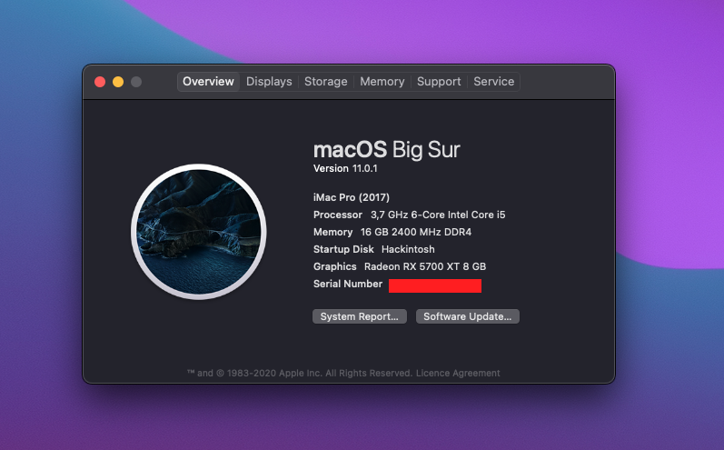

# Gigabyte Designare Z390 - Intel i5 9600kf - OpenCore - macOS ~~Catalina~~ Big Sur

## About this repo
I use this repository to keep track of changes I make to my OpenCore setup.
Currently I've updated to BigSur, but you can find a working OpenCore config for Catalina as well.

## Hardware
[PCPartPicker Part List](https://pcpartpicker.com/list/NRtRmg)

Type|Item
:----|:----
**CPU** | [Intel Core i5-9600KF 3.7 GHz 6-Core Processor](https://pcpartpicker.com/product/MBMwrH/intel-core-i5-9600kf-37-ghz-6-core-processor-bx80684i59600kf)
**CPU Cooler** | [Noctua NH-U12S chromax.black 55 CFM CPU Cooler](https://pcpartpicker.com/product/dMVG3C/noctua-nh-u12s-chromaxblack-55-cfm-cpu-cooler-nh-u12s-chromaxblack)
**Motherboard** | [Gigabyte Z390 DESIGNARE ATX LGA1151 Motherboard](https://pcpartpicker.com/product/ycL48d/gigabyte-z390-designare-atx-lga1151-motherboard-z390-designare)
**Memory** | [Kingston HyperX Predator RGB 16 GB (2 x 8 GB) DDR4-3200 CL16 Memory](https://pcpartpicker.com/product/rpsmP6/kingston-hyperx-predator-rgb-16-gb-2-x-8-gb-ddr4-3200-memory-hx432c16pb3ak216)
**Storage** | [Samsung 970 Evo Plus 500 GB M.2-2280 NVME Solid State Drive](https://pcpartpicker.com/product/TwWfrH/samsung-970-evo-plus-500-gb-m2-2280-nvme-solid-state-drive-mz-v7s500bam)
**Storage** | [Samsung 970 Evo Plus 1 TB M.2-2280 NVME Solid State Drive](https://pcpartpicker.com/product/Zxw7YJ/samsung-970-evo-plus-1-tb-m2-2280-nvme-solid-state-drive-mz-v7s1t0bam)
**Video Card** | [Sapphire Radeon RX 5700 XT 8 GB NITRO+ Video Card](https://pcpartpicker.com/product/WGLwrH/sapphire-radeon-rx-5700-xt-8-gb-nitro-video-card-11293-03-40g)
**Case** | [NZXT H510 ATX Mid Tower Case](https://pcpartpicker.com/product/6Cyqqs/nzxt-h510-atx-mid-tower-case-ca-h510b-w1)
**Power Supply** | [Corsair RMx (2018) 850 W 80+ Gold Certified Fully Modular ATX Power Supply](https://pcpartpicker.com/product/VgQG3C/corsair-rmx-2018-850w-80-gold-certified-fully-modular-atx-power-supply-cp-9020180-na)
**Monitor** | [Samsung LC43J890DKNXZA 43.0" 3840x1200 120 Hz Monitor](https://pcpartpicker.com/product/yCc48d/samsung-lc43j890dknxza-430-3840x1200-120hz-monitor-lc43j890dknxza)
**Mouse** | [Glorious PC Gaming Race MODEL D Wired Optical Mouse](https://pcpartpicker.com/product/6qwkcf/glorious-pc-gaming-race-model-d-wired-optical-mouse-gd-white)
**Wireless Network Adapter** | [fenvi FV-T919 PCIe x1 802.11a/b/g/n/ac Wi-Fi Adapter](https://pcpartpicker.com/product/BJ97YJ/fenvi-fv-t919-none-wi-fi-adapter-fv-t919)

## Benchmarks (Geekbench 5)
CPU:
- Single core: [1097](https://browser.geekbench.com/v5/cpu/4852820)
- Multi-core: [4916](https://browser.geekbench.com/v5/cpu/4852820)

Compute (GPU):
- Metal: [76258](https://browser.geekbench.com/v5/compute/1880481)
- OpenCL: [69838](https://browser.geekbench.com/v5/compute/1880487)

## Features
- macOS Big Sur 11.0.1
- OpenCore 0.6.3 (Release)

## **Functionality**

#### **What works** 
- Wi-Fi
- Shutdown / Restart / Sleep
- USB 3.0/3/1
- Thunderbold 3 (including charging and hotswapping)
- NVMe
- APFS (actually, APFS is required for this build)
- iMessage, etc.

#### **What doesn't work**
- Bluetooth
- AirDrop and other continuity features
- Audio jacks (front and back)
## **Installation**

#### **Customize the `config.plist`**

The following fields have been replaced by `[REPLACEME]` (for ease of Cmd+F):

- `config.plist` > `PlatformInfo`
  - `SystemSerialNumber`
  - `SystemUUID`
  - `MLB`
    Follow these [instructions](https://dortania.github.io/OpenCore-Desktop-Guide/post-install/iservices.html#generate-a-new-serial) to generate your own unique identifiers. The AppleCare step is optional.

#### **Update your motherboard's BIOS firmware**

- Visit [Gigabyte's website](https://www.gigabyte.com/us/Motherboard/Z390-DESIGNARE-rev-10/support#support-dl-bios) and make sure you're running the latest version of the bios
  - I'm on version `F9i`

#### **BIOS configuration**

This is by no means an extensive list. This is just some stuff unique to z390 BIOS.

The most important settings are:
  - CSM: disabled
  - SecureBoot: disabled
  - iGPU (onboard graphics): disabled
  - Above 4G decoding: enabled

## **About this custom EFI**

#### **Most important differences from The Official Guide**

- DevirtualiseMmio: `true` - add MmioWhitelist in case of `[EB|#LOG:EXITBS:START]` error
- add `SSDT-Z390-DESIGNARE-TB3HP-V4.aml` ACPI
- boot args `alcid=15 agdpmod=pikera shikigva=80 slide=0`
- Adding the `HfsPlus.efi` driver
- If you're having issues, be sure to enable debugging [as described in the OpenCore docs](https://dortania.github.io/OpenCore-Install-Guide/config.plist/coffee-lake.html#debug), and also grab [the `DEBUG` version of OpenCorePkg](https://github.com/acidanthera/OpenCorePkg/releases). For debugging help see the [Troubleshooting section of this page](https://github.com/baughmann/designaire-z390-intel-i9-9900k-opencore#troubleshooting).

## **Troubleshooting**

- Check your `config.plist` against the corresponding version using [OpenCore Sanity Checker](https://opencore.slowgeek.com/).
- Read the official [OpenCore Desktop Guide for Coffee Lake](https://dortania.github.io/OpenCore-Install-Guide/config.plist/coffee-lake.html) when making changes to the `config.plist` and the guide's [Gather Files section](https://dortania.github.io/OpenCore-Install-Guide/ktext.html#firmware-drivers) when picking drivers and kexts.
- check BIOS settings

## **Changelog**
- **19 Nov 2020:**
  - Updated to macOS Big Sur from Catalina
  - Changed `slide=1` to `slide=0`
  - add boot arg `slide=0`
  - update bios firmware to version `F9i`
  - update BIOS settings, disable `CGFLock`
  - Removed `RadeonBoost.kext`
  - Added MmioWhitelist to fix [Stuck on [EB|#LOG:EXITBS:START]](https://dortania.github.io/OpenCore-Install-Guide/troubleshooting/extended/kernel-issues.html#stuck-on-eb-log-exitbs-start)